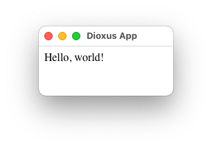

# Hello World

Let's put together a simple "hello world" to get acquainted with Dioxus. The Dioxus-CLI has an equivalent to "create-react-app" built-in, but setting up Dioxus apps is simple enough to not need additional tooling.

This demo will build a simple desktop app. Check out the platform-specific setup guides on how to port your app to different targets.

### A new project with Cargo

First, let's start a new project. Rust has the concept of executables and libraries. Executables have a `main.rs` and libraries have `lib.rs`. A project may have both. Our `hello world` will be an executable - we expect our app to launch when we run it! Cargo provides this for us:

```shell
$ cargo new --bin hello-dioxus
```

Now, we can `cd` into our project and poke around:

```shell
$ cd hello-dioxus
$ tree
.
├── Cargo.toml
├── .git
├── .gitignore
└── src
    └── main.rs
```

We are greeted with a pre-initialized git repository, our code folder (`src`) and our project file (`Cargo.toml`).

Our `src` folder holds our code. Our `main.rs` file holds our `fn main` which will be executed when our app is ran.

```shell
$ more src/main.rs
```

```rust
fn main() {
    println!("Hello, world!");
}
```

Right now, whenever our app is launched, "Hello world" will be echoed to the terminal.

```shell
$ cargo run
   Compiling hello-dioxus v0.1.0
    Finished dev [unoptimized + debuginfo] target(s) in 0.41s
     Running `target/debug/hello-dioxus`
Hello, world!
```

Our `Cargo.toml` file holds our dependencies and project flags.

```shell
$ cat Cargo.toml
```

```toml
[package]
name = "hello-dioxus"
version = "0.1.0"
edition = "2018"

# See more keys and their definitions at https://doc.rust-lang.org/cargo/reference/manifest.html

[dependencies]

```

### Adding Dioxus as a dependency

To use the Dioxus library, we'll want to add the most recent version of `Dioxus` to our crate. If you have `cargo edit` installed, simply call:

```shell
$ cargo add dioxus --features desktop
```

It's very important to add `dioxus` with the `desktop` feature for this example. The `dioxus` crate is a batteries-include crate that combines a bunch of utility crates together, ensuring compatibility of the most important parts of the ecosystem. Under the hood, the `dioxus` crate configures various renderers, hooks, debug tooling, and more. The `desktop` feature ensures the we only depend on the smallest set of required crates to compile and render.

If you plan to develop extensions for the `Dioxus` ecosystem, please use the `dioxus` crate with the `core` feature to limit the amount of dependencies your project brings in.

### Our first app

Now, let's edit our `main.rs` file:

```rust
use dioxus::prelude::*;


fn main() {
    dioxus::desktop::start(App, |c| c);
}

fn App(cx: Component<()>) -> Element {
    cx.render(rsx! (
        div { "Hello, world!" }
    ))
}
```

At this point, you could call `cargo run` and be greeted with a simple `Hello, World!` screen:



### Dissecting our example

This bit of code imports everything from the the `prelude` module. This brings into scope the right traits, types, and macros needed for working with Dioxus.

```rust
use diouxs::prelude::*;
```

This initialization code launches a Tokio runtime on a helper thread - where your code will run, and then the WebView on the main-thread. Due to platform requirements, the main thread is blocked by this call.

```rust
fn main() {
    dioxus::desktop::start(App, |c| c);
}
```

Finally, our app. Every component in Dioxus is a function that takes in `Context` and `Props` and returns an `Option<VNode>`.

```rust
fn App(cx: Component<()>) -> DomTree {
    cx.render(rsx! {
        div { "Hello, world!" }
    })    
}
```

The closure `FC<()>` syntax is identical to the function syntax, but with lifetimes managed for you. In cases where props need to borrow from their parent, you will need to specify lifetimes using the function syntax:

```rust
fn App<'a>(cx: Component<'a, ()>) -> DomTree<'a> {
    cx.render(rsx! {
        div { "Hello, world!" }
    })    
}
```

### The `Context` object

In React, you'll save data between renders with hooks. However, hooks rely on global variables which make them difficult to integrate in multi-tenant systems like server-rendering. In Dioxus, you are given an explicit `Context` object to control how the component renders and stores data.

### The `rsx!` macro

Next, we're greeted with the `rsx!` macro. This lets us add a custom DSL for declaratively building the structure of our app. The semantics of this macro are similar to that of JSX and HTML, though with a familiar Rust-y interface. The `html!` macro is also available for writing components with a JSX/HTML syntax.

The `rsx!` macro is lazy: it does not immediately produce elements or allocates, but rather builds a closure which can be rendered with `cx.render`.
